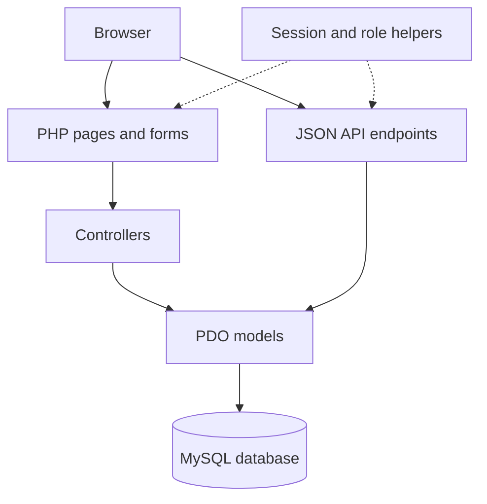

<div align="center">


# VarsityScholar

### University Research Collaboration Portal

**Connect researchers. Discover opportunities. Move ideas forward.**

A role-based platform that brings students, supervisors, coordinators, and administrators into one research workspace.


[Explore Features](#features) · [Get Started](#getting-started) · [Architecture](#architecture) · [API Overview](#api-overview)

</div>

---

## Overview

VarsityScholar organizes university research collaboration—from discovering an opportunity and submitting an application to forming teams, reviewing proposals, and tracking project milestones.

Each user role has a dedicated workspace. Students find research opportunities and follow their work; supervisors manage teams and research delivery; coordinators oversee departments and projects; administrators manage accounts and platform activity.

Built with plain PHP, PDO, MySQL, and vanilla JavaScript, the project runs in a conventional Apache/PHP environment without Composer, npm, or a frontend build pipeline.

## Contents

- [Features](#features)
- [Roles and Workspaces](#roles-and-workspaces)
- [Research Workflow](#research-workflow)
- [Technology Stack](#technology-stack)
- [Getting Started](#getting-started)
- [Architecture](#architecture)
- [Project Structure](#project-structure)
- [Database Overview](#database-overview)
- [API Overview](#api-overview)
- [Interface and Accessibility](#interface-and-accessibility)
- [Authentication and Validation](#authentication-and-validation)
- [Verification](#verification)
- [Troubleshooting](#troubleshooting)
- [Development Priorities](#development-priorities)
- [Maintainer and Acknowledgment](#maintainer-and-acknowledgment)

## Features

| Module | Capabilities |
| --- | --- |
| **Accounts and access** | Registration, password-based login, session authentication, and role-specific dashboards |
| **Research opportunities** | Create, browse, view, edit, and manage opportunities |
| **Applications** | Student applications, application history, and supervisor review |
| **Research teams** | Team creation, member assignment, member removal, and team details |
| **Proposals** | Team-based proposal submission and supervisor approval or rejection |
| **Research projects** | Project creation, project details, status updates, and progress tracking |
| **Milestones** | Milestone creation, due dates, status updates, and project-linked tracking |
| **Feedback** | Supervisor feedback and student access to relevant feedback |
| **Announcements** | Administrative and coordinator publishing, editing, and status management |
| **Notifications** | User-specific notifications, unread counts, and read-state management |
| **Administration** | User search, account management, role counts, and activity logs |
| **Departments** | Department creation, viewing, editing, and deletion |

## Roles and Workspaces

| Role | ID | Main responsibilities | Dashboard |
| --- | --- | --- | --- |
| **Administrator** | `1` | Manage users, review activity, manage research opportunities and announcements | `views/admin/dashboard.php` |
| **Student** | `2` | Browse opportunities, apply, view teams, submit proposals, track milestones, and read feedback | `views/student/dashboard.php` |
| **Supervisor** | `3` | Publish opportunities, review applications and proposals, manage teams and projects, and provide feedback | `views/supervisor/dashboard.php` |
| **Coordinator** | `4` | Manage departments, monitor research projects, and publish announcements | `views/coordinator/dashboard.php` |

These roles share connected research records; their responsibilities are intentionally complementary.

## Research Workflow

1. **Publish an opportunity.** A supervisor defines a research opportunity for students to explore.
2. **Apply and review.** A student submits an application; the supervisor reviews it. The application controller creates a supervisor notification when an application is submitted successfully.
3. **Organize a team.** A supervisor creates a research team and manages its members.
4. **Submit a proposal.** A student submits a proposal associated with a team and an opportunity.
5. **Review and establish a project.** A supervisor reviews the proposal and can create a project from an approved proposal.
6. **Track the work.** Milestones, status updates, and feedback support continued project oversight.

These are separate application actions; accepting an application does not imply that a team or project is created automatically.

### How project progress is calculated

The project model assigns a score to each milestone:

| Milestone status | Score |
| --- | ---: |
| Pending | 0 |
| In Progress | 50 |
| Completed | 100 |

The progress calculation returns the rounded average of these scores. A project with no milestones returns `0`. For example, one completed milestone and one in-progress milestone produce **75%** progress.

## Technology Stack

| Layer | Technology |
| --- | --- |
| Presentation | HTML, custom CSS, SVG branding |
| Browser interactions | Vanilla JavaScript |
| Server-side application | PHP classes and PHP-rendered pages |
| Database access | PDO with the MySQL driver |
| Database | MySQL-compatible database; use the project's matching schema |
| Authentication | PHP sessions and password hashing |
| API responses | JSON over HTTP |
| Local environment | XAMPP with Apache and MySQL/MariaDB |

## Getting Started

### 1. Prepare the environment

Install XAMPP with PHP and the `pdo_mysql` extension enabled, then start **Apache** and **MySQL**.

Use a modern browser for the JavaScript-enhanced interface. Exact minimum PHP and database versions have not been established by a compatibility test suite.

### 2. Place the project in the web root

Clone the repository inside your XAMPP `htdocs` directory:

```bash
git clone https://github.com/srabon-d-costa/VarsityScholar.git VarsityScholar
cd VarsityScholar
```

Alternatively, download the project ZIP and extract its contents into:

```text
C:\xampp\htdocs\VarsityScholar
```

If XAMPP is installed on another drive, use that installation's `htdocs` directory. Keep the application directory named **VarsityScholar**, because several asset paths and redirects use `/VarsityScholar/`.

### 3. Import the database

> **Database prerequisite:** The current project package does not include a `.sql` export or an automatic database installer. Obtain the matching VarsityScholar schema and seed data from the maintainer, or export them from an existing working installation. Creating an empty database alone is not sufficient.

Open [phpMyAdmin](http://localhost/phpmyadmin), create a database named `VarsityScholar` if the supplied export does not create it, and import the matching export.

Ensure the imported role IDs match the role table above. The current registration form also expects these department IDs:

| Department ID | Department |
| --- | --- |
| `1` | CSE |
| `2` | EEE |
| `3` | BBA |

If your seed data uses different departments or IDs, align the registration form with that data before creating users.

### 4. Configure the connection

Edit the existing properties in `config/database.php`:

```php
private $host = "localhost";
private $db_name = "VarsityScholar";
private $username = "root";
private $password = "";
```

These are local development defaults. Set the username and password to the credentials used by your own database server.

### 5. Open the login page

Visit:

**[http://localhost/VarsityScholar/views/auth/login.php](http://localhost/VarsityScholar/views/auth/login.php)**

Registration is available at:

**[http://localhost/VarsityScholar/views/auth/register.php](http://localhost/VarsityScholar/views/auth/register.php)**

The root `index.php` currently displays a development landing page; it is not the application's central router.

### 6. Set up accounts

The registration interface offers Student, Supervisor, and Coordinator roles. There is **no bundled default administrator username or password**.

For a local demonstration, register your own account and have the database owner assign that account `role_id = 1` in the `users` table. Sign out and sign in again after changing the role. Use separate accounts to test the other workspaces.

## Architecture

VarsityScholar uses an **MVC-style separation**: models contain database operations, controllers coordinate application behavior, and PHP views render the interface. Many view files also handle incoming form requests before rendering. Separate API scripts expose JSON operations.



The interface uses normal page navigation and form submissions. The presence of API endpoints does not mean every screen is an AJAX client or that the application is a single-page app.

## Project Structure

| Path | Purpose |
| --- | --- |
| `index.php` | Development landing page |
| `config/database.php` | PDO database connection |
| `controllers/` | Authentication, administration, research, teams, projects, and related application logic |
| `models/` | SQL queries and record operations |
| `helpers/session.php` | Session and cookie configuration |
| `helpers/auth_check.php` | Login and page-role checks |
| `helpers/api.php` | API authentication, role checks, request validation, and shared utilities |
| `helpers/json_response.php` | JSON response helper |
| `views/auth/` | Login, registration, and logout |
| `views/admin/` | Administrator pages |
| `views/student/` | Student pages |
| `views/supervisor/` | Supervisor pages |
| `views/coordinator/` | Coordinator pages |
| `views/research/` | Shared research opportunity pages |
| `api/` | Resource-oriented PHP endpoints returning JSON |
| `assets/css/style.css` | Shared design system and responsive styles |
| `assets/js/app.js` | Navigation, theme preference, page search, and UI enhancements |
| `assets/images/` | VarsityScholar icon and light/dark logo variants |

## Database Overview

The models reference the following core tables. This is an application-level overview, not a substitute for the actual schema or a verified foreign-key diagram.

| Area | Tables |
| --- | --- |
| Users and organization | `users`, `roles`, `departments` |
| Research discovery | `research_categories`, `research_opportunities`, `opportunity_applications` |
| Collaboration | `research_teams`, `team_members`, `proposals` |
| Project delivery | `research_projects`, `milestones`, `feedback` |
| Communication and audit | `announcements`, `notifications`, `activity_logs` |

## API Overview

API scripts are organized by resource beneath `/VarsityScholar/api/` and use the existing PHP session for authentication. Requests that modify records use the method required by the endpoint and, where applicable, a JSON request body.

Representative endpoints:

| Method | Path relative to `/VarsityScholar/` | Access | Purpose |
| --- | --- | --- | --- |
| `GET` | `api/admin/dashboard.php` | Administrator | User counts by role |
| `GET` | `api/admin/users.php` | Administrator | List users; supports `search` or `role_id` filtering |
| `GET` | `api/research/opportunities.php` | Authenticated users | List research opportunities |
| `GET` | `api/applications/mine.php` | Student | View the current student's applications |
| `GET` | `api/projects/supervisor.php` | Supervisor | View the current supervisor's projects |
| `GET` | `api/projects/all.php` | Administrator, Coordinator | View all projects |
| `GET` | `api/notifications/count.php` | Authenticated users | Current user's unread notification count |
| `PUT` | `api/notifications/read_all.php` | Authenticated users | Mark the current user's notifications as read |

For example, after signing in, this read-only request can run in the browser console on the same origin:

```javascript
fetch('/VarsityScholar/api/notifications/count.php', {
  credentials: 'same-origin'
})
  .then(async (response) => {
    const result = await response.json();
    if (!response.ok) {
      throw new Error(result.message || 'Request failed');
    }
    console.log(result);
  })
  .catch(console.error);
```

An illustrative response is:

```json
{
  "success": true,
  "unread_count": 3
}
```

The count is an example. Actual values come from the signed-in user's records. Consult each endpoint for its required fields and record-level access checks.

## Interface and Accessibility

- **Consistent branding:** an original SVG mark and light/dark wordmarks.
- **Shared visual system:** navy-and-teal navigation, cards, tables, and form styling.
- **Light and dark themes:** the preference is stored locally when browser storage is available.
- **Page finder:** use **Ctrl+K** or **Command+K** to search workspace navigation.
- **Mobile navigation:** a collapsible sidebar with keyboard focus handling.
- **Form assistance:** associated labels and password visibility controls.
- **Motion preferences:** decorative animations respect reduced-motion settings.
- **Keyboard access:** skip-to-content, focus indicators, and Escape-to-close interactions.

The page finder searches navigation destinations, not database records. Database-backed user search is a separate administrator feature.

## Authentication and Validation

The current source includes:

| Mechanism | Implementation |
| --- | --- |
| Password storage and verification | `password_hash()` and `password_verify()` |
| Password rules | Minimum eight characters, including uppercase, lowercase, a digit, and a special character |
| Login session renewal | `session_regenerate_id(true)` after successful authentication |
| Session configuration | Cookie-only sessions, strict session mode, HttpOnly, and SameSite=Lax |
| HTTPS cookie flag | Enabled when the server reports an HTTPS connection |
| Page authorization | `checkLogin()` and `checkRole()` |
| API validation | Request-method checks, role checks, required fields, and integer/date validation helpers |
| Database queries | PDO prepared statements in model operations |

These mechanisms describe the implementation; they are not a completed security audit. CSRF protection, registration role restrictions, output escaping, and record ownership checks across both page and API routes remain areas for review before public deployment.

## Verification

Use an existing working database to verify the complete application:

| Test area | Expected result |
| --- | --- |
| Authentication | Each role signs in to its own dashboard and signs out successfully |
| Access restrictions | A user cannot open a workspace belonging to another role |
| Opportunity and application flow | A supervisor publishes an opportunity and reviews a student's application |
| Team and proposal flow | A team can be created, members assigned, and a proposal submitted and reviewed |
| Project tracking | Projects and milestones save correctly; progress calculations match milestone states |
| Communications | Announcements, feedback, and notifications appear for the intended users |
| Administration | User search and account updates reflect database changes |
| Interface | Navigation, themes, forms, and tables remain usable at desktop and phone widths |

A visual preview or successful page render does not establish that database operations and authorization behave correctly. Complete these checks in the intended runtime before a demonstration or release.

## Troubleshooting

| Symptom | What to check |
| --- | --- |
| Database connection fails | Start MySQL; verify the database name and credentials in `config/database.php` |
| A table is missing | Import the matching schema and seed data; an empty `VarsityScholar` database is insufficient |
| Styles or links return 404 | Confirm the project is served from `/VarsityScholar/` and that `assets/` was copied |
| The root page does not show login | Open `/VarsityScholar/views/auth/login.php` directly |
| Role changes do not appear | Sign out and sign in again to refresh session values |
| The previous design still appears | Hard-refresh with Ctrl+F5 and confirm both CSS and JavaScript were updated |
| Linux reports that `Admin.php` is missing | The supplied model is named `models/admin.php`, while imports use `models/Admin.php`; align the filename and references before deploying on a case-sensitive filesystem |

## Development Priorities

- Package a reproducible database schema and seed dataset.
- Add automated integration tests for role permissions and research workflows.
- Complete a security review across page handlers and API endpoints.
- Replace the development landing page with a public project introduction.
- Add real application screenshots and a documented demonstration dataset.

These are development targets, not claims of completed features.

## Maintainer and Acknowledgment

**Repository:** [srabon-d-costa/VarsityScholar](https://github.com/srabon-d-costa/VarsityScholar)

**GitHub profile:** [@srabon-d-costa](https://github.com/srabon-d-costa)

Documentation organization was informed by [Wahidul Alam Riyad's Library Management System](https://github.com/wahidulalamriyad/full-stack-library-management-system). The descriptions and setup instructions above are specific to VarsityScholar.

**License:** This project is licensed under the [MIT License](LICENSE).

---

<div align="center">

**VarsityScholar — a space for ideas to become discoveries.**

</div>
